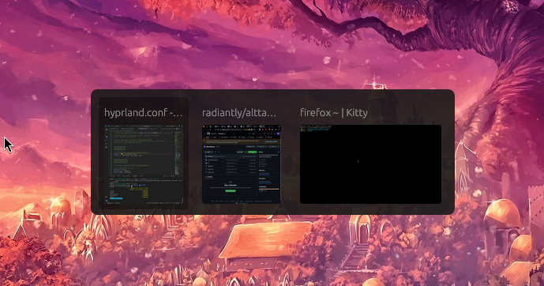

# alttabway

Finally, an alt-tab window switcher with actual window previews.



### Usage

You will need rust and cargo installed for building.

```sh
git clone https://github.com/radiantly/alttabway
cd alttabway
cargo install --path .
```

alttabway is now installed! Follow compositor specific instructions to start the daemon and bind the hotkey.

#### Hyprland

Add the following lines to your `~/.config/hypr/hyprland.conf`
```
exec-once = alttabway daemon &
bindn = ALT, Tab, exec, alttabway show
```

### FAQ

#### The window preview is sometimes missing. Why?

alttabway uses wlr-screencopy-unstable-v1 to generate a preview of your active window. Sometimes, it is unable to generate this preview if you open a window and navigate away from it too quickly.

#### Sometimes there's a delay between holding the alt-tab and the window showing up

Window preview resizing runs on the main thread and needs to move to a background thread. Should be fixed soon.

#### Please support $COMPOSITOR

alttabway only provides support for Hyprland (Sway and Niri coming in the near future). Open an issue if you'd like support for your compositor. Typically the compositor should implement the following protocols.

 - wlr-foreign-toplevel-management-unstable-v1 for the list of top level windows and to activate one
 - wlr-screencopy-unstable-v1 to take a capture of a region on screen.
   - Window positions/dimensions are required as well, typically via ipc.

#### The alttabway window doesn't show up

Try switching the rendering backend from vulkan to gl in `wgpu_wrapper.rs`.
